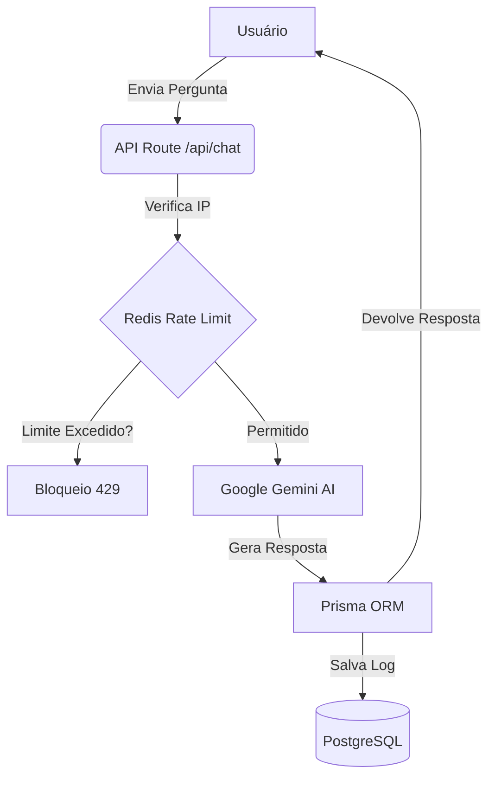

# 🤖 CQLE DBA Virtual - AI Database Consultant

> **Seu Consultor Sênior de Banco de Dados disponível 24/7.**
> Um assistente inteligente capaz de gerar queries, analisar performance e identificar riscos em SQL Server, Oracle e MongoDB.

🔗 **Acesse o projeto online:** [dba.cqle.com.br](https://dba.cqle.com.br)

---

## 📸 Preview

---

## 🚀 Sobre o Projeto

O **CQLE DBA Virtual** é uma aplicação Fullstack desenvolvida para auxiliar desenvolvedores e DBAs no dia a dia. Diferente de um chat genérico, este sistema foi arquitetado com foco em **segurança, auditoria e controle de custos**.

Ele utiliza o modelo **Google Gemini 1.5 Flash** instruído com uma persona técnica (System Instruction) para evitar respostas vagas e focar em soluções de alta performance.

### ✨ Principais Funcionalidades

- 🧠 **IA Especializada:** Respostas técnicas e precisas sobre SQL e NoSQL.
- 🛡️ **Rate Limiting (Segurança):** Implementação de "Sliding Window" via **Redis**. Limita usuários a 5 perguntas/hora para evitar abusos e custos excessivos.
- 💾 **Memória Corporativa:** Todas as interações (perguntas e respostas) são auditadas e salvas em um banco **PostgreSQL**.
- ⚡ **Performance:** Interface reativa construída com Next.js 15 e Tailwind CSS.

---

## 🛠️ Tech Stack (Tecnologias)

O projeto utiliza uma arquitetura moderna e escalável (Serverless):

| Categoria          | Tecnologia                                      |
| :----------------- | :---------------------------------------------- |
| **Frontend**       | React 19, Next.js 15 (App Router), Tailwind CSS |
| **Backend/API**    | Next.js API Routes (Serverless Functions)       |
| **AI Model**       | Google Gemini 1.5 Flash (via Google AI Studio)  |
| **Database**       | PostgreSQL (Hospedado na Neon Tech)             |
| **ORM**            | Prisma (Gerenciamento de Schemas e Migrations)  |
| **Cache/Security** | Upstash Redis (Rate Limiting)                   |
| **Deploy/Infra**   | Vercel (CI/CD + Edge Network)                   |

---

## 🏗️ Arquitetura do Sistema

O fluxo de dados segue um padrão rigoroso de verificação antes de processar a IA:

